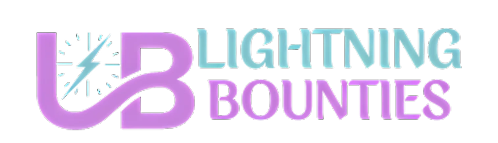

<div align="center">
  <a href="https://git.io/typing-svg"></a>
    <div align="center" style="display: flex; flex-wrap: wrap; justify-content: center; gap: 20px; border: 2px solid #4285f4; padding: 20px; border-radius: 10px;">

  <a href="https://https://x.com/LBounties" target="_blank">
    
  </a> 
  <a href="https://docs.lightningbounties.com" target="_blank">
    
  </a>
  <a href="https://app.lightningbounties.com" target="_blank">
    
  </a>
</div>
</div>
  <div align="center">
  <a href="https://github.com/Lightning-Bounties">
    
  </a>
  </div>

## About
In the current landscape, many open-source bug bounty platforms inadvertently shut out developers from regions outside the USA and EU, creating barriers to participation and diversity. To address this, Lightning Bounties is revolutionizing open-source development by integrating Bitcoin payments directly into GitHub. This approach aligns with the core principles of the open-source software and Bitcoin movements—decentralization, transparency, and inclusivity—by offering seamless and instantaneous financial rewards to developers globally. By leveraging the Bitcoin Lightning Network, Lightning Bounties ensures that contributions to open-source projects are directly rewarded, fostering a sustainable and thriving community where developers can easily receive compensation for their valuable work

## How to Contribute

1. **Find an open bounty** on our [bounty platform](https://app.lightningbounties.com) or in the [Issues tab](https://github.com/Lightning-Bounties/docs/issues).
2. **Fork this repository** and create a new branch for your work.
3. **Make your changes** and commit them with clear, concise commit messages.
4. **Submit a Pull Request** with a detailed description of your changes.
5. **Get paid in SATs** once your PR is reviewed and merged!

***For a full guide on our contribution process,*** please check our [Contribution Guidelines](about-lb/contributing.md).

## Why Contribute?
  
- **Earn Bitcoin**: Get paid in sats for your valuable contributions.
- **Learn**: Dive deep into Open-Source, Bitcoin, & Lightning Network technologies and uncover the future of money and decentralized tech.
- **Accelerate Bug Fixes**: Collaborate with talented security researchers to speed up bug fixes, saving newbie coders valuable time.
- **Join the Community**: Become part of the vibrant Open-Source Movement and build the future you want to see.

## Getting Started
 
### Installation

Below is an example of how you can instruct your audience on installing and setting up your app. 

1. Clone the repo
   ```sh
   git clone https://github.com/Lightning-Bounties/lb-next
   ```
2. Install NPM packages
   ```sh
   npm install
   ```
3. Env Vars: <em> edit as needed </em>
   ```sh
   cp .env.local.example .env.local
   ```
4. Config Files: <em> edit as needed </em>
   ```js
   tsconfig.json
   ```  
5. Run Dev Server
   ```sh
   npm run dev
   ```
6.  Grab a JWT token from the production backend and add it to your local storage under the dev server domain.
    - see documents for instructions and video [here](https://docs.lightningbounties.com/docs/solve-a-bounty/working-on-opensource-frontend-lb-next).
      

## Top contributors: 

<a href="https://github.com/Lightning-Bounties/lb-next/graphs/contributors">
  
</a>


<div align="center">
<h2><span> Special Thanks </span></h2>  
</div>
<div align="center">

| <h3><a href="https://branta.pro">Branta</a></h3> | <h3><a href="https://www.gitbook.com">GitBook</a></h3> | <h3><a href="https://www.pleblab.dev/">PlebLab</h3> |
|:-------:|:-------:|:--------------------:|
|  |  |  |
| <p align="center" width="240">Branta offers payment verification <br>for various bitcoin and lightning technologies.</p> | <p align="center" width="240">GitBook: Documentation platform<br>for teams to share knowledge</p> | <p align="center" width="240">PlebLab is founder-led and founder-focused, <br>providing resources and mentorship to drive<br>impactful Bitcoin companies since 2021.</p> |
</details>
</div>
<br>
<div align="center">
  <p>
    <a href="https://docs.lightningbounties.com"><strong>Explore the docs » </strong></a>
  </>  ⚡
    <a href="https://blog.lightningbounties.com/"><strong>Read Our Blog » </strong></a>
  </p>
  <p> 
    <a href="https://docs.lightningbounties.com/docs/getting-started/getting-started">View Demo</a> »
    <a href="https://app.lightningbounties.com"> Open Bounties</a> »
    <a href="https://github.com/Lightning-Bounties/lb-next/issues">Report Bug</a> »
    <a href="https://github.com/orgs/Lightning-Bounties/projects/2/views/1">Roadmap</a>
  </p>

</div>
